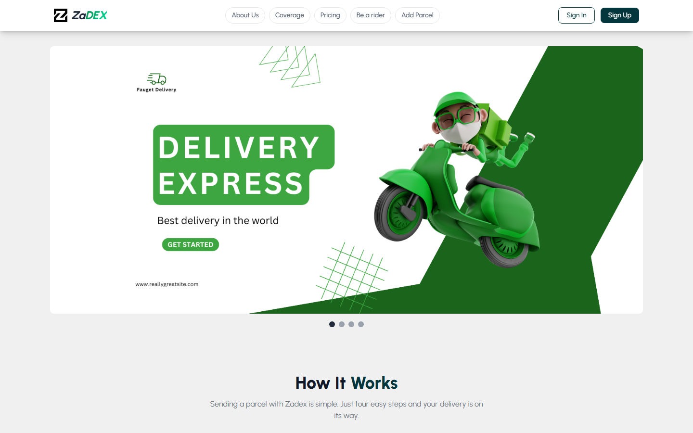
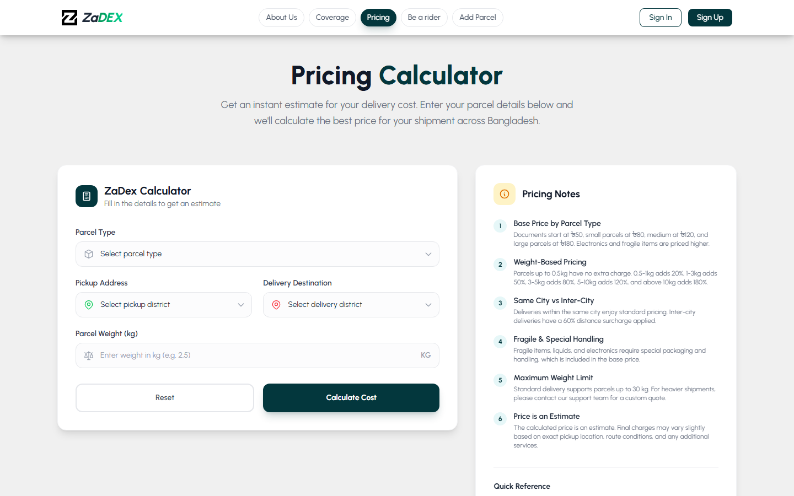
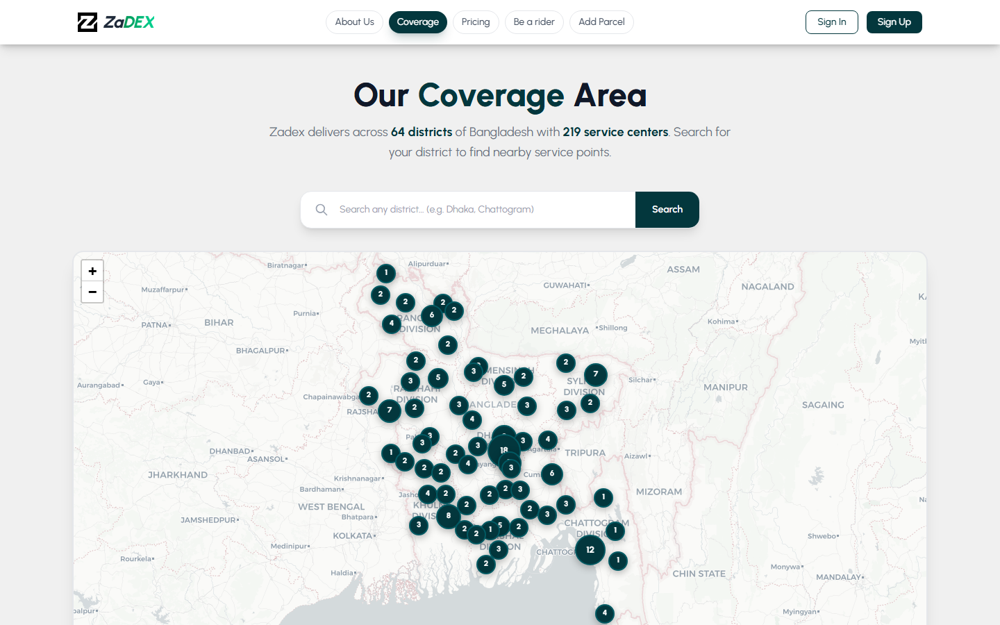
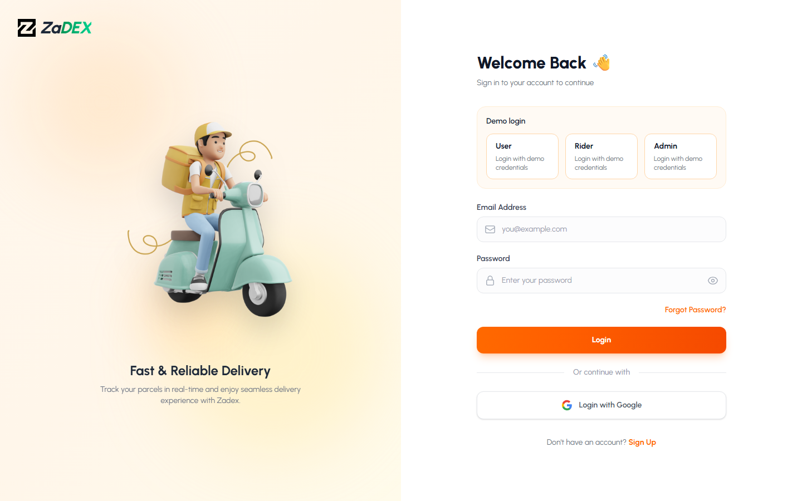
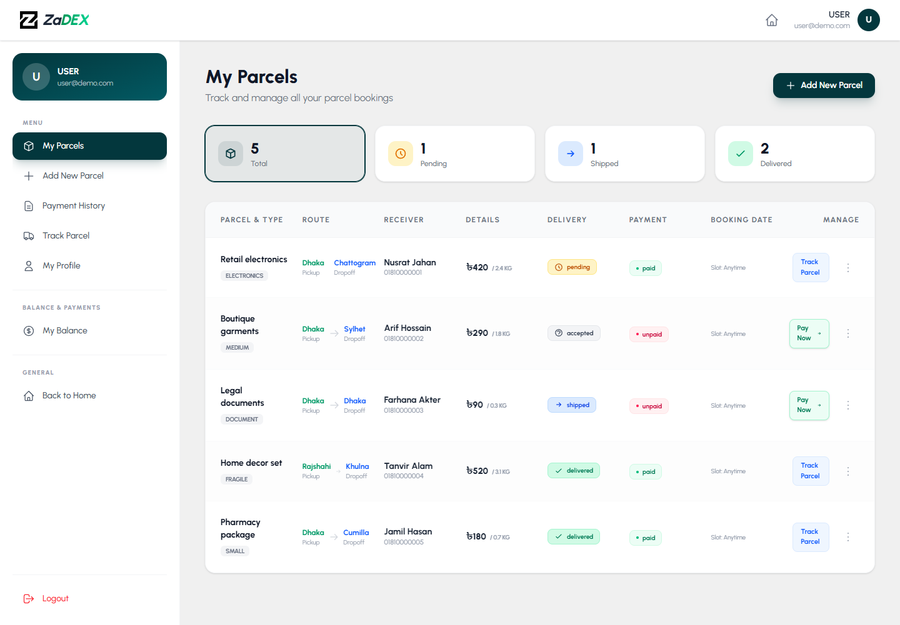
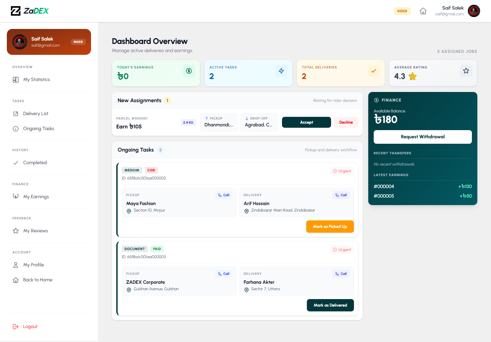
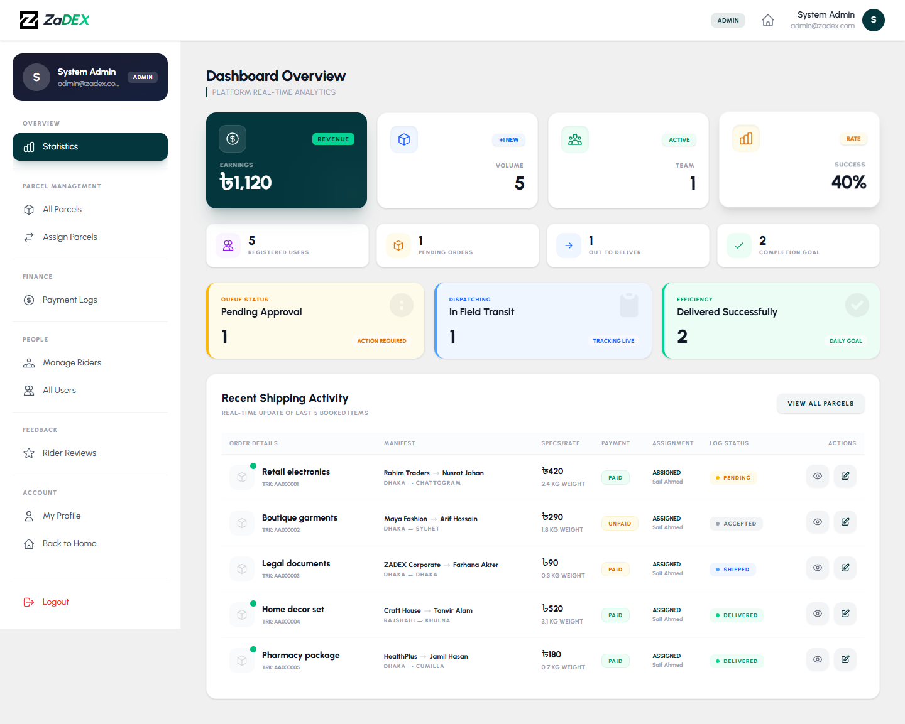

# ZaDEX Client

ZaDEX is a role-based parcel delivery management client for customers, riders, and administrators. It helps a delivery business accept parcel bookings, track parcel progress, assign riders, manage users, collect payments, and review operational performance from dedicated dashboards.

This repository contains the React/Vite frontend. It connects to a backend API for parcel data, JWT creation, role checks, payments, and dashboard analytics.

## Project Snapshot

| Area | Details |
| --- | --- |
| Product type | Logistics and parcel delivery web app |
| Primary users | Customers or merchants, delivery riders, administrators |
| Frontend | React 19, Vite 7, Tailwind CSS 4 |
| Routing | React Router with public, private, and admin-only routes |
| Auth | Firebase Authentication plus backend-issued JWT |
| Data fetching | Axios and TanStack React Query |
| Maps | Leaflet and React Leaflet |
| Payments shown | bKash and Nagad UI assets |
| Deployment target | Vercel static build output from `dist/` |

## Screenshots

### Home Page



### Pricing Calculator



### Coverage Map



### Login and Demo Accounts



### Customer Dashboard



### Rider Statistics Dashboard



### Admin Statistics Dashboard



## What ZaDEX Does

For non-technical readers, ZaDEX is built around three clear workflows:

| User type | Main goal | What they can do |
| --- | --- | --- |
| Customer / merchant | Send and manage parcels | Book parcels, calculate delivery cost, pay, track status, edit pending bookings, view payment history |
| Rider | Complete assigned deliveries | Review assigned parcels, accept or reject tasks, update delivery progress, view completed deliveries, track earnings |
| Admin | Operate the delivery network | View statistics, manage users and riders, approve rider applications, assign parcels, review payments, monitor all parcels |

## Core Features

### Customer Features

- Parcel booking with sender, receiver, route, parcel type, and delivery details.
- Dynamic pricing calculator for delivery cost estimation.
- Personal dashboard for parcel history and payment status.
- Parcel tracking by current delivery state.
- Secure login using Firebase Authentication.
- Profile management with image upload support through Cloudinary.

### Rider Features

- Rider-specific dashboard after role detection.
- Delivery list for assigned tasks.
- Ongoing task workflow for active deliveries.
- Completed delivery history.
- Earnings view for delivery income tracking.
- Rider review visibility.

### Admin Features

- Admin statistics dashboard.
- All-parcel management and filtering.
- Rider assignment workflow.
- User management and role control.
- Rider application management.
- Payment log review.
- Rider review monitoring.

## Technical Architecture

ZaDEX follows a feature-based frontend structure. The application shell, route configuration, layouts, and providers live separately from business features and shared utilities.

```txt
src/
  app/
    layouts/          App, auth, and dashboard layouts
    providers/        Auth context provider
    router/           Route definitions and route guards
    styles/           Global stylesheet
    main.jsx          React app bootstrap

  features/
    auth/             Login and registration
    dashboard/        Admin, user, rider dashboard pages
    error/            Error page
    home/             Home page and public sections
    parcels/          Parcel booking
    rider/            Rider application flow

  shared/
    components/       Reusable layout-level components
    data/             Static app data
    hooks/            Shared hooks
    lib/              Third-party integrations such as Firebase
    services/         API/auth helper services
    ui/               Loaders and reusable UI blocks

  assets/             Images, logos, payment assets, animations
```

### Authentication Flow

1. User signs in with Firebase email/password or Google.
2. Client requests a backend JWT using the authenticated email.
3. JWT is stored in `localStorage` under `zadex_token`.
4. Secure Axios requests attach the token as `Authorization: Bearer <token>`.
5. Backend role endpoint decides whether the user sees customer, rider, or admin dashboard content.

### Route Protection

- Public routes: home, coverage, pricing, about, login, register.
- Private routes: rider application, add parcel, dashboard shell.
- Admin-only routes: statistics, all parcels, rider assignment, payment logs, rider/user management.
- Dashboard index redirects content by role:
  - Admin sees admin statistics.
  - Rider sees rider overview.
  - Customer sees personal parcels.

## Tech Stack

| Category | Libraries / tools |
| --- | --- |
| Framework | React, Vite |
| Styling | Tailwind CSS |
| Routing | React Router DOM |
| Server state | TanStack React Query |
| HTTP client | Axios |
| Authentication | Firebase Auth |
| Maps | Leaflet, React Leaflet |
| Animation / media | Lottie React, React Fast Marquee |
| PDF generation | jsPDF, jsPDF AutoTable |
| Quality checks | ESLint |
| Hosting | Vercel |

## Environment Variables

Create `.env.local` in the project root. The variable names must match the code exactly.

```env
VITE_SERVER_URL=http://localhost:5000

VITE_apiKey=your_firebase_api_key
VITE_authDomain=your_firebase_auth_domain
VITE_projectId=your_firebase_project_id
VITE_storageBucket=your_firebase_storage_bucket
VITE_messagingSenderId=your_firebase_messaging_sender_id
VITE_appId=your_firebase_app_id

VITE_CLOUDINARY_CLOUD_NAME=your_cloudinary_cloud_name
VITE_CLOUDINARY_UPLOAD_PRESET=your_cloudinary_unsigned_upload_preset
```

An example file is included at `.env.example`.

## Getting Started

### Prerequisites

- Node.js and npm
- Firebase project with Authentication enabled
- Backend API running locally or deployed
- Cloudinary upload preset if profile image uploads are needed

### Installation

```bash
git clone https://github.com/millathossain115/ZaDEX-Client.git
cd ZaDEX-Client
npm install
```

### Run Locally

```bash
npm run dev
```

The app runs at:

```txt
http://localhost:5173
```

### Production Build

```bash
npm run build
```

### Preview Production Build

```bash
npm run preview
```

### Lint

```bash
npm run lint
```

## Demo Login Accounts

The login screen includes demo buttons for the three major roles.

| Role | Email | Password |
| --- | --- | --- |
| User | `user@demo.com` | `user12345` |
| Rider | `saif@gmail.com` | `1234567890` |
| Admin | `admin@zadex.com` | `admin123` |

These accounts require matching Firebase users and backend role records to work in a deployed environment.

## API Expectations

The frontend expects the backend to provide endpoints for:

- JWT creation: `POST /jwt`
- User role lookup: `GET /users/role?email=...`
- Parcel CRUD and parcel tracking
- Rider applications and rider management
- Admin statistics
- Payment records and payment logs
- Reviews and rider earnings

The exact backend implementation is separate from this client repository.

## Deployment Notes

ZaDEX is configured for Vercel with `vercel.json` rewrites so React Router routes work after refresh.

Recommended Vercel settings:

| Setting | Value |
| --- | --- |
| Framework preset | Vite |
| Build command | `npm run build` |
| Output directory | `dist` |
| Install command | `npm install` |
| Root directory | Project root |

Add all required environment variables in the Vercel project settings before deployment.

## Build Health

Current local verification:

- `npm run lint` passes.
- `npm run build` passes.
- Vite transforms roughly 544 modules during production build.
- Main JavaScript bundle is currently large because dashboard, PDF, map, and animation dependencies are bundled together.

Known build warnings:

- `lottie-web` uses `eval` internally.
- Some chunks are larger than Vite's default 500 KB warning limit.

These warnings do not block deployment, but future performance work should add route-level lazy loading and manual chunks.

## Project Quality Notes

- The codebase uses path aliases such as `@/app`, `@/features`, `@/shared`, and `@/assets`.
- Simple one-file pages are flattened for readability.
- Pages with local implementation details keep local folders, for example `MyParcels/components`.
- Shared services are separated from UI components.
- Role-specific dashboard behavior is centralized through route guards and dashboard layout logic.

## Suggested Future Improvements

- Add lazy loading for dashboard routes to reduce initial JavaScript size.
- Add automated UI tests for login, private route redirects, and dashboard role rendering.
- Add typed API response contracts or migrate critical shared modules to TypeScript.
- Add more README screenshots for payment, rider assignment, and parcel tracking flows.
- Add CI checks for lint and build before deployment.
